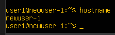
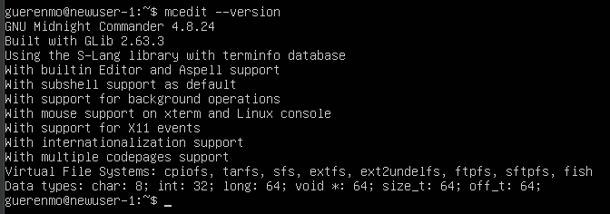
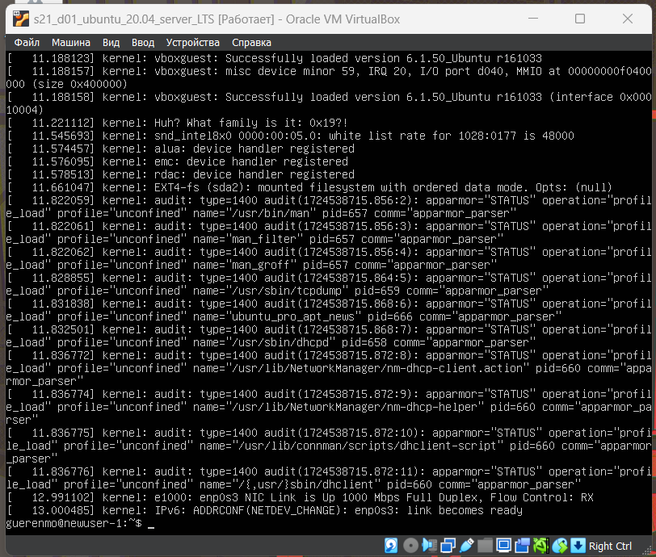

# Операционные системы UNIX/Linux (Базовые)

`// made by guerenmo // да пребудет с нами линукс` 

Установка и обновления системы Linux. Основы администрирования.

## Разделы
1. [Установка ОС](#part-1-установка-ос)  
2. [Создание пользователя](#part-2-создание-пользователя)  
3. [Настройка сети ОС](#part-3-настройка-сети-ос)   
4. [Обновление ОС](#part-4-обновление-ос)  
5. [Использование команды  sudo](#part-5-использование-команды-sudo)  
6. [Установка и настройка службы времени](#part-6-установка-и-настройка-службы-времени)  
7. [Установка и использование текстовых редакторов](#part-7-установка-и-использование-текстовых-редакторов)  
8. [Установка и базовая настройка сервиса SSHD](#part-8-установка-и-базовая-настройка-сервиса-sshd)   
9. [Установка и использование утилит top, htop](#part-9-установка-и-использование-утилит-top-htop)   
10. [Использование утилиты fdisk](#part-10-использование-утилиты-fdisk)   
11. [Использование утилиты df](#part-11-использование-утилиты-df)    
12. [Использование утилиты du](#part-12-использование-утилиты-du)    
13. [Установка и использование утилиты ncdu](#part-13-установка-и-использование-утилиты-ncdu)    
14. [Работа с системными журналами](#part-14-работа-с-системными-журналами)     
15. [Использование планировщика заданий CRON](#part-15-использование-планировщика-заданий-cron)    

## Part 1. Установка ОС

* Установил Ubuntu 20.04 Server LTS без граф. интерфейса

    
* Узнал версию Ubuntu через команду `cat /etc/issue`

    

## Part 2. Создание пользователя

* Создал нового пользователя `user1` и поместил его в группу `adm` с помощью команды `adduser` (в начале создал пользователя, потом добавил его через ту же команду с указанием группы `adm`)

    

* Нашел информацию о новом пользователе `user1` в файле `/etc/passwd` в самом конце (воспользовался утилитой grep для упрощения поиска)

    

* Узнал находится ли пользователь `user1` в группе adm

    

## Part 3. Настройка сети ОС

**Задай название машины вида user-1**

* Задал название машины именем `user-1`. Для этого изменил текущее значение `hostname` (имя нашей машины) в файлах `/etc/hostname` и `/etc/hosts`. Данный способ позволяет сохранить новое имя машины даже после перезагрузки.

* Отредактировал файл `/etc/hostname` с помощью текстового редактора `vi` - `sudo vi /etc/hostname`

    `// ps если интересно как: тык i, редактируем файл, тык esc, пишем :wq (w - сохранение, q - выход)`

    
        
    Изменения в файле `/etc/hostname` сохранены

    

* Отредактировал файл `/etc/hosts` с помощью текстового редактора `vi` - `sudo vi /etc/hosts`

    
* Изменения в файле `/etc/hosts` сохранены

    
* После перезагрузки проверил текущее название машины через команду `hostnamectl` без параметров

    

**Установи временную зону, соответствующую твоему текущему местоположению**

* Установил часовой пояс на `Европа/Москва`. Для этого задал символическую ссылку для файла `/etc/localtime` на файл часового пояса. Файлы с настройками часовых поясов хранятся в папке `/usr/share/zoneinfo` и разделены по часовым зонам

    

    `// ps скрин был сделан после выполнения всей работы //`

* Символическую ссылку задал через команду `ln -sf /usr/share/zoneinfo/Europe/Moscow /etc/localtime` (опция `-s` создает символическую ссылку вместо жесткой, опция `-f` заменяет существующую ссылку на новую)

    
    
* Через команду `date` (скрин выше) и `timedatectl status` узнал о текущем часовом поясе. Теперь установлен московский часовой пояс

    

**Выведи названия сетевых интерфейсов с помощью консольной команды**

* В папке `/sys/class/net` хранятся файлы сетевых интерфейсов. Поэтому достаточно вывести информацию о содержимом папки с помощью команды `ls`, чтобы узнать названия сетевых интерфейсов

    

* Интерфейс `lo (loopback device)` представляет собой виртуальный сетевой интерфейс, который используется для отладки сетевых программ и запуска серверных приложений на локальной машине. Данный интерфейс присутствует в системе по умолчанию

* Интерфейс `enp0s3` является сетевым адаптером Ethernet, он позволяет компьютеру выйти в глобальную сеть

**Используя консольную команду, получи ip адрес устройства, на котором ты работаешь, от DHCP-сервера**

* Определил ip-адрес устройства с помощью команды `ip a`

    Команда `ip` позволяет просмотреть сетевые интерфейсы и их ip-адреса, опция `a` дает увидеть только сетевые адреса

    

    Для интерфейса **lo** установлен адрес `127.0.0.1`, для **enp0s3** - `10.0.2.15`

* DHCP-сервер - это сетевой протокол, который автоматически выдает ip-адреса и другие параметры сетевым устройствам для работы в сети TCP/IP, `то есть он занимается автоматической настройкой сетевых конфигураций устройств`.

**Определи и выведи на экран внешний ip-адрес шлюза (ip) и внутренний IP-адрес шлюза, он же ip-адрес по умолчанию (gw)**

* Вывел ip-адрес внешнего шлюза (публичный ip-адрес) с помощью команды `curl ifconfig.me`

    

    ip-адрес внешнего шлюза - `51.77.20.49`

* Вывел ip-адрес внутреннего шлюза (ip-адрес по умолчанию) с помощью команды `ip route | grep "default"`

    

    ip-адрес внутреннего шлюза - `10.0.2.2`

**Задай статичные (заданные вручную, а не полученные от DHCP-сервера) настройки ip, gw, dns (используй публичный DNS-серверы, например 1.1.1.1 или 8.8.8.8)**

* Задал статичные настройки ip, gw, dns, отредактировав файл с конфигурацией сети `/etc/netplan/00-installer-config.yaml`

* Данный YAML файл содержит в себе перечисление сетевых интерфейсов и их параметров и представляет собой текстовый файл с строгим синтаксисом (отступы, пробелы или табуляция очень важны, иначе настройки будут некорректно записаны)

* Открыл файл `/etc/netplan/00-installer-config.yaml` с помощью редактора `vi`

    

* Здесь уже настроен сетевой интерфейс Ethernet и включен DHCP-сервер, который, как уже упоминалось, занимается автоматической настройкой сети на устройстве

* Включил режим редактирования, отключил DHCP-сервер и задал статичные настройки сети

    

    * в поле `gateway4` указал ip-адрес шлюза по умолчанию `10.0.2.2`

    * в поле `addresses` указал ip-адрес `10.0.2.15/24` (ip-адрес интерфейса Ethernet)

    * в поле `nameservers` указал ip-адреса двух DNS-серверов - `8.8.8.8` и `1.1.1.1`
    
* Для применения настроек запустил команду `netplan` с опциями `generate` для проверки корректности заданных настроек и `apply` для запуска настроек

    

* После перезагрузки `// команда sudo reboot //` через команды `ip route show`, `ip addr show` и `hostname -I` (опция `-I` команды `hostname` выводит ip-адрес системы)

    

    Команды вывели ip-адреса, которые указал ранее в файле Netplan

* Пропинговал удаленные хосты `1.1.1.1`, `8.8.8.8` и `ya.ru`

    

    

    

    В конце вывода всех команд отмечено `0% packet loss`, что говорит об успешном соединении (пакеты данных, отправленные командой `ping` дошли до целевого сервера и пришли обратно в полном порядке)

## Part 4. Обновление ОС

* Для обновления системных пакетов воспользовался командой `sudo apt upgrade`. После повторного использования команды выводит сообщение `0 upgraded, 0 newly installed, 0 to remove and 0 not upgraded`. Данное сообщение говорит о том, что пакеты обновлены до последней версии

    

## Part 5. Использование команды  sudo

* Добавил пользователя `user1` в группу `sudo` для того, чтобы он мог использовать одноименную команду. Использовал команду `usermod -aG sudo user1`

    

* Сочетание опций `-aG` позволяет добавить пользователя в дополнительную группу без удаления его из существующих

* Сменил пользователя с `guerenmo` на `user1` с помощью команды `su user1`

    

* Изменил текущее имя машины (hostname) на `newuser-1` от лица пользователя `user1`

    

    

* После перезагрузки настройки применились, новое имя хоста отображается в командной строке и через команду `hostname`

    

* Команда `sudo` позволяет выполнить любую команду от имени любого пользователя, обычно от имени суперпользователя (root), не выходя из-под своего пользователя

* Команда `su` позволяет переключиться на другого пользователя, без указания имени пользователя переключает на суперпользователя (root)

## Part 6. Установка и настройка службы времени

* Вывел время текущего часового пояса (в котором нахожусь, мск) с помощью команды `timedatectl`

    

* Через эту же команду проверил настройку служб автоматической синхронизации времени (с опцией `show`)

    

    В данном случае служба синхронизации времени включена

* Для включения/выключения службы синхронизации времени с NTP-серверами можно воспользоваться командой `timedatectl set-ntp` со значением `true` или `false`

* NTP-серверы - серверы, которые обеспечивают синхронизацию времени на компьютерах и других устройствах через сеть, предоставляя более точное время

## Part 7. Установка и использование текстовых редакторов

**Cоздание файлов**

* Vim

    * Vim представляет собой мощный текстовый редактор. Он является улучшенной версией старого редактора `vi` и обладает множеством дополнительных функций
    
        Основные особенности Vim:

        * Работа в нескольких режимах (командный режим, редактирование, навигация по тексту)
        * Поддерживает плагины, скрипты и обширные возможности настройки через конфигурационные файлы
        * Возможности работы с текстом включают макросы, регулярные выражения, блоки кода, буферы и многоуровневую отмену действий.
    
    * Текстовый редактор Vim был установлен в системе по умолчанию

        

    * Создал текстовый файл `test_vim.txt` с помощью команды `vim test_vim.txt`

    * Изначально включен командный режим, в котором можно перемещаться по тексту и выполнять над ним действия с помощью клавиш и их комбинаций

    * Для входа в режим редактирования нажал `i`, после нажатия всплывает внизу сообщение `INSERT`

        

        В созданный файл записал свой ник - `guerenmo`

    * Для выхода из этого режима нажал `Esc`

    * Для сохранения результата ввёл `:wq` и `Enter` (команда `w` позволяет сохранить файл, а команда `q` выйти из редактора)

* nano

    * nano довольно простой текстовый редактор, обладающий интуитивным и минималистичным интерфейсов. Обладает стандартными инструментами копирования, вставки, поиска и замены текста, работу с файлами и т.п.
    
        Основные команды отображаются внизу и запускаются комбинациями клавиш (ctrl, shift и буквы)
    
    * Текстовый редактор nano был установлен в системе по умолчанию

        

    * Создал текстовый файл `test_nano.txt` с помощью команды `nano test_nano.txt`

    * Файл можно редактировать сразу после запуска редактора

        

        В созданный файл записал свой ник - `guerenmo`

    * Для сохранения результата нажал `Ctrl` + `O` и `Enter`, далее для выхода из редактора нажал `Ctrl` + `X`

* mcedit

    * mcedit - это текстовый редактор, встроенный в Midnight Commander (mc), популярный файловый менеджер для Unix-подобных систем. mcedit является удобным и функциональным редактором, который сочетает простоту использования с достаточно мощными возможностями редактирования.
    
    * Текстовый редактор mcedit не был установлен изначально

        

    * Перед установкой редактора необходимо обновить программные пакеты

        

    * После обновления установил редактор mcedit с помощью команды `sudo apt install mcedit`

        

    * Создал текстовый файл `test_mcedit.txt` с помощью команды `mcedit test_mcedit.txt`

    * Файл можно редактировать сразу после запуска редактора

        

        В созданный файл записал свой ник - `guerenmo`

    * Для сохранения результата нажал `F2` и `Enter` для подтверждения операции

    * Для выхода из редактора нажал `F10`

    * В конце всех операций можно увидеть созданные файлы и их содержимое

        

**Редактирование файлов**

* Vim

    * Открыл файл `test_vim.txt` с помощью команды `vim test_vim.txt`

    * Вошел в режим редактирования (нажал `i`) и поменял содержимое файла на `21 School 21`

        

    * Для выхода из этого режима нажал `Esc`

    * Для сохранения результата без сохранения ввёл `:q!` (команда `!` позволяет принудительно выполнить команду)

* nano

    * Открыл текстовый файл `test_nano.txt` с помощью команды `nano test_nano.txt`

    * После открытия редактора сразу же поменял содержимое файла на `21 School 21`

        

    * Нажал `Ctrl` + `X` для выхода из редактора и `N` на сообщение `"Save modified buffer?"`

* mcedit

    * Открыл текстовый файл `test_mcedit.txt` с помощью команды `mcedit test_mcedit.txt`

    * После открытия редактора сразу же поменял содержимое файла на `21 School 21`

        

    * Для выхода из редактора нажал `F10`, выбрал `No` и нажал `Enter` на сообщение `"File /home/guerenmo/test_mcedit.txt was modified. Save before close?"`

    * В конце всех операций можно увидеть содержимое файлов, текст остался прежним

        

        

        

**Поиск и замена слов**

* Vim

    * Открыл файл `test_vim.txt` с помощью команды `vim test_vim.txt`

    * Вошел в режим редактирования (нажал `i`) и поменял содержимое файла на `21 School 21`

    * Для выхода из этого режима нажал `Esc`

    * Для поиска ввёл `/<слово>`, в данном случае `/21`, и `Enter`

        

    * Редактор подсвечивает вхождение слова в тексте и указывает его начало в правом нижнем углу (редактор нашел два вхождения `21` в местах 1.1 и 1.11). Дальнейшее переключение между результатами посика производится вводом `n` (следующее значение) и `Shift` + `n` (предыдущее значение)

        

    * Для замены подстроки во всем файле на другую подстроку в командном режиме ввёл `%s/текущее значение подстроки/новое значение/g` (`%s` - выполнить замену во всем файле, `g` - замена всех совпадений)

        

    * В данном случае заменил подстроку `21` на `twenty one <3`

* nano

    * Открыл файл `test_nano.txt` с помощью команды `nano test_nano.txt`

    * Поменял содержимое файла на `21 School 21`

    * Для поиска использовал команду `Ctrl` + `W`. Внизу появится окно `Search:`, в которой нужно ввести подстроку для поиска и нажать `Enter`. Для поиска следующего вхождения данного выражения используется сочетание клавиш `Alt` + `W`. Для поиска предыдущего - `Alt` + `Q`. Результат поиска подстроки '21'

        

    * Для замены подстроки во всем файле на другую подстроку нажал `Ctrl` + `\`. Внизу экрана появится окно `Search (to replace)`, в котором нужно ввести подстроку для поиска и нажать `Enter`. Далее появится окно `Replace with`, в котором нужно ввести подстроку для замены и нажать `Enter`. Система подсвечивает вхождение и спрашивает `Replace this instatnce?` (Y - yes, N - no (при выборе этого варианта переходит к следующему вхождению), A - all (замена всех вхождений), ^С - cancel)
    
    * Результат замены:

        

    * В данном случае заменил подстроку `21` на `twenty one <3`

* mcedit

    * Открыл файл `test_mcedit.txt` с помощью команды `nano test_mcedit.txt`

    * Поменял содержимое файла на `21 School 21`

    * Для поиска использовал команду `F7`. Появится окно, в котором нужно ввести подстроку для поиска. Можно настроить поиск (использовать регулярные выражения, игнорировать регистр и т.д.)

        
    
    * Далее нужно выбрать `OK` для поиска первого вхождения или `Find all` для подсвечивания всех вхождений

        

    * Для поиска следующего значения нужно нажать `F7` + `Enter`

        

    * Для замены подстроки во всем файле на другую подстроку нажал `F4`. Появится окно, в котором нужно ввести подстроку для поиска и подстроку для замены. Доступна настройка поиска

        

    * Далее будет появляться окно с подтверждением каждой замены подстроки. Можно выбрать `All` для замены всех вхождений сразу. Также можно контроллировать процесс замены - какие-то вхождения оставить, выбрав `Skip`

        

    * В файле успешно заменена подстрока `21` на `twenty one <3`

        

## Part 8. Установка и базовая настройка сервиса SSHD

* `SSHd` (Secure Shell Daemon) — это служба в Unix-подобных системах, которая реализует протокол SSH (Secure Shell). Основная функция sshd — обеспечить безопасный удалённый доступ к серверу, позволяя пользователям подключаться и выполнять команды на удалённой машине. sshd отвечает за управление входящими SSH-соединениями и предоставление средств для безопасной аутентификации

* Перед установкой сервиса SSHD обновил программные пакеты командой `sudo apt update`

    

* Установил пакет OpenSSH Server командой `sudo apt install openssh-server`

* Проверил работает ли служба командой `sudo systemctl status ssh`

    

* Добавил автостарт службы при запуске системы командой `sudo systemctl enable ssh`

    

* Открыл файл конфигурации SSHD в редакторе vim `sudo vim /etc/ssh/sshd_config`

    

* Нашел строку с `#Port 22` и заменил на `Port 2022` (без знака `#`)

    

* С помощью команды `ps aux | grep sshd` смог найти наличие процесса sshd. Команда `ps` используется для отображения информации о запущенных процессах

    

    С этой командой используются следующие ключи:

    * `a` - показать процесссы всех пользователей
    * `u` - показать процессы с деталями, такими как пользователь, под которым запущен процесс, и используемая память
    * `x` - показать процессы, не привязанные к терминалу (демоны и службы)

* Перезагрузил систему

* Вывел список активных соединений командой `netstat -tan`

    

Kоманда `netstat` с ключем `-tan` выводит список всех активных сетевых соединений на компьютере, а также прослушивающих портов и состояний соединений. Этот ключ включает в себя три отдельных ключа:

* `-t` – указывает netstat отобразить только TCP-соединения
* `-a` – указывает netstat отобразить все соединения и прослушиваемые порты
* `-n` – указывает netstat отобразить числовые значения портов и ip-адресов вместо их символьных имен

Значение столбцов в выводе команды netstat -tan:
* `Proto` – протокол, который используется для соединения
* `Recv-Q` – длина очереди приема байтов для соединения (если равно 0, то очереди нет, и приложение успешно обрабатывает полученные данные)
* `Send-Q` – длина очереди отправки байтов для соединения
* `Local Address` – локальный ip-адрес и порт
* `Foreign Address` – внешний ip-адрес и порт (удаленный хост)
* `State` – Состояние соединения. Это может быть `LISTEN` (порт активен и готов принимать входящие соединения от удаленных устройств), `ESTABLISHED` (соединение между локальным и удаленным узлом установлено и активно, теперь между ними может происходить обмен данными), `CLOSE_WAIT` (локальный сокет завершил откправку данных и теперь ждет подтверждения о закрытии соединения от удаленного узла) и другие

В контексте команды netstat -tan, если 0.0.0.0 появляется в столбце Local Address, это означает, что порт прослушивается на всех сетевых интерфейсах устройства (доступен для всех устройств, подключенных к сети, или для любого клиента в интернете, если устройство имеет публичный ip-адрес). Если 0.0.0.0 появляется в столбце Foreign Address, это означает, что соединение может быть установлено с любого IP-адреса.

## Part 9. Установка и использование утилит top, htop

Команды `top` и `htop` – инструменты мониторинга производительности – позволяют просматривать информацию о текущем использовании системных ресурсов и запущенных процессах.

* Команды `top` и `htop` были установлены в системе изначально

* Вывод команды `top`

    

* Значения полей в таблице процессов

    * `PID` - идентификатор процесса
    * `USER` - пользователь, запустивший процесс
    * `PR` - приоритет процесса
    * `NI` - измененный приоритет (присвоенный пользователем с помощью команды nice)
    * `VIRT`- объем используемой виртуальной памяти (здесь выводится тот объем памяти, который был запрошен процессом, даже если фактически используется меньше)
    * `RES` - объем используемой оперативной памяти
    * `SHR` - объем памяти, разделяемой с другими процессами (т.е.  память, которая может быть использована другими процессами)
    * `S` - статус процесса 
        * `R` - running - запущен 
        * `S`- sleeping - в ожидании
        * `Z` - zombie - процесс-«зомби» (завершен, но запись о процессе осталась)
        * `D` - uninterruptible sleep - в состоянии сна
        * `T` - stopped - остановлен
        * `I` - idle - простой (не выполняет никаких задач)
    * `%CPU` - процент использования процессорного времени
    * `%MEM` - процент использования оперативной памяти
    * `TIME+` - общее время работы процесса
    * `COMMAND` - имя процесса (команда, которой был запущен процесс)

* `uptime` - 4 минуты (прошедшее время с последней загрузки системы)
* `количество авторизованных пользователей` - 1 пользователь
* `количество авторизованных пользователей` - 1 user 
* `общая загрузка системы` - 0.01, 0.07, 0.03 (load average – среднее количество процесоов, ожидающих доступа к ЦП в течение последних 1, 5 и 15 минут)
* `общее количество процессов`: 131 (Tasks total)
* `загрузка cpu`
    * 0.0 us: 0.0% времени процессора занято пользовательскими процессами
    * 0.1 sy: 0.1% времени процессора занято системными процессами
    * 0.0 ni: 0.0% времени процессора занято процессами с приоритетом ниже нормального
    * 99.9 id: 99.9% времени процессора простаивает, т.е. не используется
    * 0.0 wa: 0.0% времени процессора ждет ввода-вывода.
    * 0.0 hi: 0.0% времени процессора ждет обработки аппаратных прерываний
    * 0.0 si: 0.0% времени процессора ждет обработки программных прерываний
    * 0.0 st: 0.0% времени процессора занято виртуализацией
* `загрузка памяти (MiB Mem)` - общий объем оперативной памяти составляет 5929.5 мегабайт, из которых:
    * 5510.9 мегабайт свободны
    * 171.2 мегабайт используются
    * 247.3 мегабайт используются для буферизации и кэширования
* `pid процесса занимающего больше всего памяти` - 736
        (для сортировки процессов по использованию памяти воспользовался командой `Shift` + `M`)

    

* `pid процесса, занимающего больше всего процессорного времени` - 427 
        (для сортировки процессов по занимаемому процессорному времени воспользовался командой `Shift` + `P`)

    

* для выхода нажал `q`

* Вывод команды `htop`

    

* Для сортировки процессов нажал `F6` и переключился на нужное поле сортировки, затем нажал `ENTER`

* Сортировка процессов по полю `PID`

    

* Сортировка процессов по полю `PERCENT_CPU` (`CPU%`)

    

* Сортировка процессов по полю `PERCENT_MEM` (`MEM%`)

    

* Сортировка процессов по полю `TIME`

    

* Отфильтрованный вывод команды `htop` для процесса `sshd` (нажал на `F4`, ввёл в поле `sshd` и нажал `Enter`)

    

* Для вывода процессов `syslog` нажал `F3` для отображения строки поиска и ввёл `syslog` + `ENTER`, система нашла и выделила процесс (если такой процесс запущен в системе)

    

`syslog` собирает сообщения от различных компонентов системы (ошибки, предупреждения, информационные сообщения и отладочную информацию) и записывает их в лог-файлы 

* Для добавления вывода полей `hostname`, `clock` и `uptime` нажал `F2` для перехода в меню настройки конфигурации. Далее перешел в раздел `Setup` -> `Meters` -> `Available meters`, по очереди выбирал поля, нажимал `Enter` и стрелками перевожу в `Left column` / `Right column`. В `Left column` перечислены поля, которые отображаются в левой части экрана, в `Right column` соответственно в правой части экрана

    

* Установил `hostname`, `clock` и `uptime`в правой части экрана

    

* Для удаления поля из вывода нужно нажать `Del`, для выхода из меню настройки нажать `F10`

## Part 10. Использование утилиты fdisk

Утилита `fdisk` позволяет создавать, изменять, удалять и просматривать разделы на дисках

* Запустил команду `fdisk -l`
    * Название жесткого диска: `/dev/sda`
    * Размер жесткого диска: 25 ГБ
    * Количество секторов: 52428800
    * swap-раздел (используется для хранения данных, которые не умещаются в оперативной памяти) отсутствует (отображался бы с ID `82` и указан как `Linux swap / Solaris`)

    

## Part 11. Использование утилиты df

Утилита `df` (disk free) используется для вывода инфо о доступном месте на файловых системах – размер файловой системы, использованное пространство и т.д.

- Вывод команды `df` (корневой раздел - `/dev/mapper/ubuntu--vg-ubuntu--lv`)

    
    * Размер раздела: 11758760 килобайт
    * Размер занятого пространства: 2803408 килобайт
    * Размер свободного пространства: 8336244 килобайт
    * Использовано 26%
    * Единица измерения памяти по умолчанию указана в килобайтах

- Вывод команды `df -Th`

    
    * Размер раздела: 12 Гб
    * Размер занятого пространства: 2.7 Гб
    * Размер свободного пространства: 8.0 Гб
    * Использовано 26%
    * Тип файловой системы: ext4
    * Опция `-T` отображает тип файловой системы
    * Опция `-h` отображает размеры в удобном формате (Кб, Мб, Гб и т.д.)

## Part 12. Использование утилиты du

Утилита `du` (disk usage) предназначена для оценки использования дискового пространства файлами и директориями

* Вывод команды `du`
    
    

* Вывод размера папки /home (в байтах, в человекочитаемом виде)

    * Использовал команду `du -hs /home` для вывода в человекочитаемом виде
        
        

    * Использовал команду `du -bs /home` для вывода в байтах
        
        

* Вывод размера папки /var (в байтах, в человекочитаемом виде)

    * Использовал команду `du -hs /var` для вывода в человекочитаемом виде
        
        

    * Использовал команду `du -bs /var` для вывода в байтах
        
        

* Вывод размера папки /var/log (в байтах, в человекочитаемом виде)

    * Использовал команду `du -hs /var/log` для вывода в человекочитаемом виде
        
        

    * Использовал команду `du -bs /var/log` для вывода в байтах
        
        

* `-h` выводит в человекочитаемом формате
* `-s` выводит только суммарный размер каждой указанной директории
* `-b` выводит размер в байтах

* Вывод размера каждого вложенного элемента в /var/log: 

    * Использовал `du -h /var/log/*` для вывода размера каждого элемента в человекочитаемом виде

        

## Part 13. Установка и использование утилиты ncdu

`ncdu` – это интерактивная командная утилита для анализа использования дискового пространства (позволяет быстро и удобно исследовать структуру каталогов и файлов на диске, оценить размер каждого элемента и удалить ненужные файлы прямо из интерфейса)

* Аналогично с [Part 12](#part-12-использование-утилиты-du) проанализировал дисковое пространство

* В начале обновил пакеты командой `sudo apt update` и установил утилиту `ncdu` командой `sudo apt install ncdu`

    

* Вывод размера папки /home командой `ncdu /home` (общий размер папки указывается внизу - `Total disk usage`)

    

* Вывод размера папки /var командой `ncdu /var`

    

* Вывод размера папки /var/log командой `ncdu /var/log`

    

* Размеры папок, выведенных командой `ncdu`, совпадают с размерами папок, выведенными командой `du` из [Part 12](#part-12-использование-утилиты-du)

## Part 14. Работа с системными журналами

Системные журналы `logs` записывают различные события и сообщения, которые происходят в операционной системе (запуск и остановка сервисов, ошибки, предупреждения и пр. важные события)

* Часть файла `/var/log/dmesg` - содержит содержит сообщения, полученные от ядра. Регистрирует много сообщений еще на этапе загрузки, в них отображается информация об аппаратных устройствах, которые инициализируются в процессе загрузки

    

* Часть файла `/var/log/syslog` - Содержит общие системные сообщения, включая информацию от различных системных служб и демонов

    

* Часть файла `/var/log/auth.log` - содержит информацию об авторизации пользователей в системе, включая пользовательские логины и механизмы аутентификации, которые были использованы

    

* Время последней успешной авторизации 27 Августа 14:26:23, имя пользователя `guerenmo`, вход был совершен по логину `systemd-logind` (`uid=0` значит, что пользователь имеет права суперпользователя):

* Перезапустил службу SSHd командой `sudo systemctl restart ssh`

* Часть файла `var/log/auth.log` с сообщениями о перезапуске службы SSHd:

## Part 15. Использование планировщика заданий CRON

`CRON` - это системный планировщик задач, который позволяет выполнять заданные команды или скрипты автоматически в заданное время или с интервалом

* Для создания задачи в планировщике CRON открыл файл настройки cron-задач с помощью команды `ctrontab -e` (откроется текстовый редактор по умолчанию). В открывшемся файле добавил строку с периодичностью исполнения и путем к исполняемой команде - `*/2 * * * * uptime`
    * `*/2` – задача будет запускаться каждые 2 минуты
    * `* * * *` - задача будет выполняться в любое время, каждый день, каждый месяц и каждый день недели
    * `uptime` - команда, которую нужно выполнить

    

* Вывод части содержания файла `/var/log/syslog`, в котором записаны строчки о выполнении команды `uptime`
    
    

    В журнале отражаются три записи выполнения команды каждые две минуты
* Вывел текущий список cron-задач командой `crontab -l`

    

* Удалил все задания из планировщика заданий командой `crontab -r` и вывел список текущих cron-задач

    

**неужели я закончил...**

чувствую себя этим котиком

